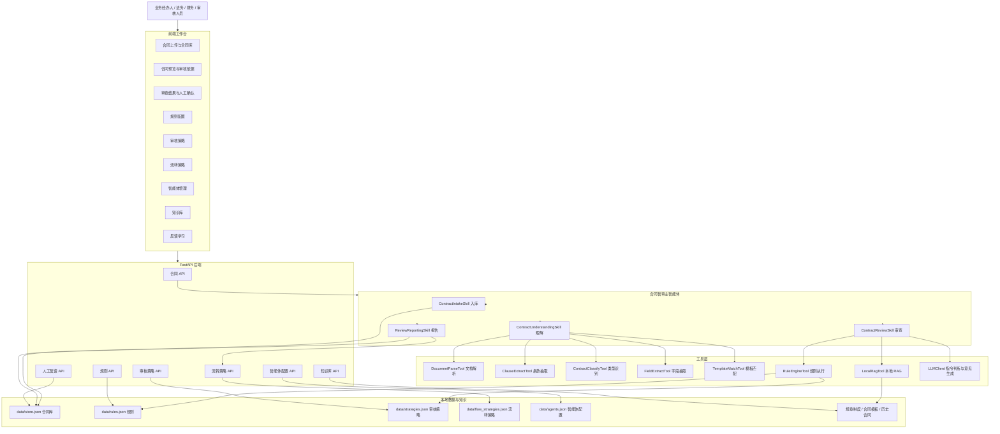

# 合同智审系统

面向企业合同审核场景的智能审查系统。系统支持合同上传、合同解析、条款对象建模、审核策略配置、规则执行、RAG 依据检索、审核流转策略、人工确认和反馈学习沉淀。

当前版本以本地可运行 MVP 为主，重点验证“先建模，再检索，再推理，再流转，再学习”的合同智审闭环。

## 核心能力

- 合同上传入库，支持 Word、PDF、TXT、MD。
- 自动解析合同正文，识别合同类型、结构化字段、合同模板和条款对象。
- 支持规则配置，包括脚本模式和指令模式。
- 支持审核策略，按合同模板类型关联不同规则集合。
- 支持审核流转策略，按风险数量、金额阈值、关键规则命中结果决定合同终态。
- 支持知识库展示和分类上传，为本地 RAG 检索提供规章制度、合同模板和历史合同内容。
- 支持智能体管理，展示和配置主智能体的提示词、Skills、工具和模型。
- 支持人工审核意见提交，并在反馈学习模块汇总人工反馈、风险、命中条款和规则上下文。

## 启动

```bash
python3 -m uvicorn backend.main:app --reload --host 127.0.0.1 --port 8123
```

浏览器访问：

```text
http://127.0.0.1:8123
```

也可以使用项目提供的启动脚本：

```bash
python3 run_local_server.py
```

## 配置 GLM

当前支持把指令模式规则接到 GLM Chat Completion。复制 `.env.example` 为 `.env.local`，并填写本地密钥：

```bash
cp .env.example .env.local
```

`.env.local` 示例：

```text
LLM_PROVIDER=glm
GLM_API_KEY=replace-with-your-glm-api-key
GLM_MODEL=glm-5
GLM_BASE_URL=https://api.z.ai/api/paas/v4
```

接口 `/api/llm/status` 可查看模型配置状态，不会返回 API Key 明文。

## 产品架构图



## 用户故事图

```mermaid
flowchart LR
  subgraph intake["合同入库"]
    us1["作为经办人，我要上传合同并填写经办信息，以便系统创建审核任务"]
    us2["作为经办人，我要看到合同库状态，以便知道合同是否待审、退回或已通过"]
  end

  subgraph understand["合同理解"]
    us3["作为审核人员，我要看到解析后的合同正文，以便确认系统读取内容正确"]
    us4["作为审核人员，我要看到合同类型、字段和条款对象，以便理解审核依据"]
    us5["作为法务人员，我要看到模板匹配结果，以便判断是否适用标准模板"]
  end

  subgraph review["智能审查"]
    us6["作为规则管理员，我要配置脚本规则和指令规则，以便覆盖确定性判断和 LLM 辅助判断"]
    us7["作为业务管理员，我要按合同模板配置审核策略，以便不同合同执行不同规则集合"]
    us8["作为审核人员，我要看到每个风险的命中条款和原文依据，以便快速复核"]
  end

  subgraph flow["审核流转"]
    us9["作为流程管理员，我要配置流转策略，以便自动区分通过、人工确认、退回和禁止流转"]
    us10["作为审核人员，我要提交人工意见，以便确认通过或退回修改"]
    us11["作为经办人，我要看到退回原因和修改建议，以便补充材料后重新提交"]
  end

  subgraph learning["反馈学习"]
    us12["作为规则运营人员，我要查看所有人工反馈，以便发现高频问题"]
    us13["作为规则运营人员，我要关联人工反馈、风险和命中条款，以便识别规则漏判或误判"]
    us14["作为规则运营人员，我要把高价值反馈沉淀为候选规则，以便后续人工确认后发布"]
  end

  intake --> understand --> review --> flow --> learning
```



## 审核链路

1. 合同上传或 API 入库。
2. `ContractIntakeSkill` 创建合同记录和审核任务。
3. `ContractUnderstandingSkill` 解析合同文本、识别合同类型、抽取字段、抽取条款对象并完成模板匹配。
4. 系统根据合同类型匹配审核策略，确定要执行的规则集合。
5. `ContractReviewSkill` 调用规则引擎执行脚本模式和指令模式规则，并结合条款片段和 RAG 证据形成风险项。
6. `ReviewReportingSkill` 汇总风险、通过规则、审查结论和默认人工审核意见。
7. 流转策略根据风险结果输出合同终态：`Completed`、`NeedHumanConfirm`、`NeedRevision`、`Blocked` 或 `Failed`。
8. 人工审核意见进入反馈学习模块，后续可用于高价值反馈识别和候选规则沉淀。

## 主要目录

- `backend/main.py`：FastAPI 接口、静态前端挂载、合同和配置管理入口。
- `backend/agent.py`：合同智审主 Agent Loop。
- `backend/agent_skills/`：业务 Skill，包括入库、理解、审查和报告。
- `backend/tools/`：确定性工具，包括文档解析、条款抽取、规则执行和本地 RAG。
- `backend/rules.py`：规则定义、默认规则和规则持久化。
- `backend/strategies.py`：审核策略定义和匹配。
- `backend/flow_strategies.py`：审核流转策略和终态决策。
- `backend/agent_configs.py`：主智能体、Skills、工具和模型配置。
- `frontend/`：原生 HTML、CSS、JavaScript 前端。
- `data/`：本地 JSON 数据，运行后生成。

## 当前实现边界

当前版本主要用于验证产品链路和工程结构，以下能力保留生产化替换点：

- 文档解析：当前以轻量解析为主，生产环境可替换为 OCR、版面解析和表格解析服务。
- RAG：当前使用本地轻量检索，生产环境可替换为向量数据库和权限隔离知识库。
- LLM：当前支持 GLM 配置，后续可增加多模型路由、调用审计和成本控制。
- 规则学习：当前已展示人工反馈样本池，后续可继续实现反馈聚类、候选规则生成、历史合同回放验证和人工发布流程。
